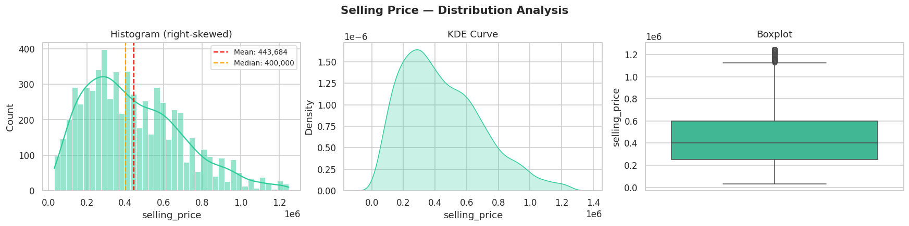
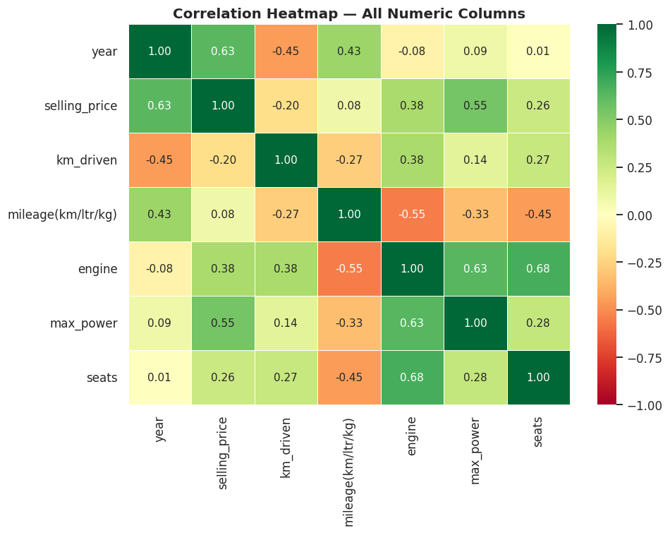
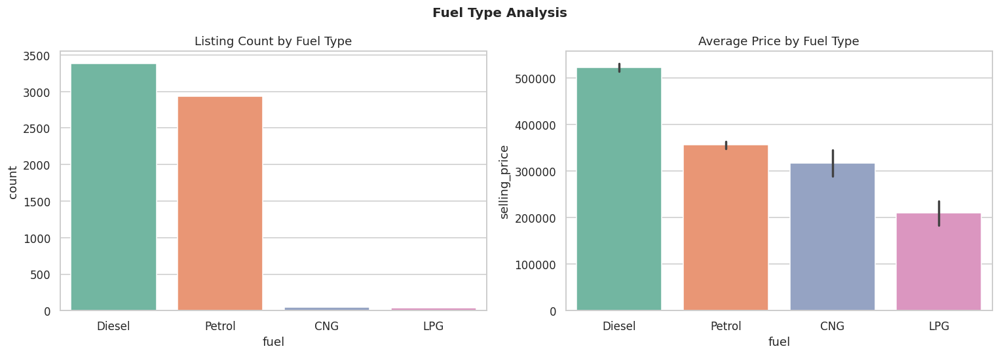
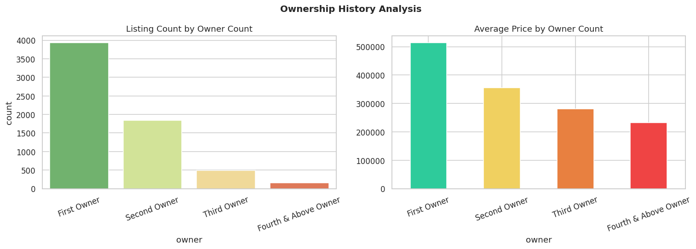
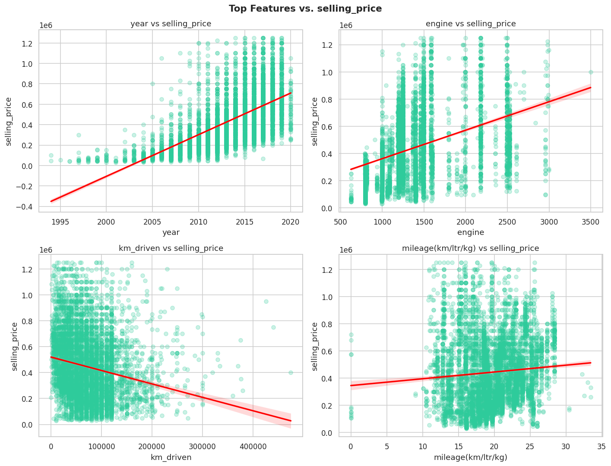

# 🚗 Car Price Exploratory Data Analysis


An exploratory data analysis of ~6,700 used-car listings, examining how selling price relates to a car's age, mileage, fuel type, ownership history, and engine specifications.

## Table of Contents

- [Overview](#overview)
- [Technologies](#technologies)
- [Dataset](#dataset)
- [Project Structure](#project-structure)
- [Key Analyses](#key-analyses)
- [Visualizations](#visualizations)
- [Key Findings](#key-findings)
- [How to Run](#how-to-run)
- [Future Improvements](#future-improvements)

## Overview

This project walks through a full EDA workflow — initial inspection, missing-value checks, data cleaning, univariate and bivariate analysis, correlation analysis, and statistical outlier detection — on a dataset of used cars listed for resale in India. The goal is to understand *what actually drives resale price* before any predictive modeling is attempted.

## Technologies

- **Python 3**
- **Pandas** / **NumPy** — data manipulation
- **Matplotlib** / **Seaborn** — visualization
- **Jupyter Notebook**

## Dataset

[Vehicle dataset from CarDekho](https://www.kaggle.com/datasets/nehalbirla/vehicle-dataset-from-cardekho) — 8,128 used-car listings scraped from cardekho.com, an Indian car marketplace. See [`data/README.md`](data/README.md) for full column descriptions and the cleaning steps applied. After cleaning (de-duplication, removing test-drive listings, and an IQR-based cap on extreme prices and odometer readings, all performed transparently inside the notebook), the analysis dataset has **6,406 rows**.

## Project Structure

```text
car-price-eda/
│
├── data/
│   ├── car_data_raw.csv     # Original, unmodified dataset
│   ├── car_data.csv         # De-duplicated + type-cleaned dataset (notebook input)
│   └── README.md            # Column descriptions & source
│
├── notebooks/
│   └── car_price_eda.ipynb  # Full EDA notebook
│
├── images/                  # Chart exports, embedded below
├── README.md
├── requirements.txt
└── .gitignore
```

## Key Analyses

1. Initial inspection (shape, dtypes, summary statistics)
2. Missing-value analysis
3. Data cleaning (unrealistic odometer readings, IQR-based price cap)
4. Univariate analysis (price distribution, log transform, brand frequency)
5. Bivariate analysis (fuel type, ownership history, mileage, top features vs. price)
6. Correlation analysis across all numeric features
7. Statistical outlier detection (IQR method)

## Visualizations

### Distribution of Selling Price


`selling_price` is right-skewed (skew = 0.69) — most cars sell between ₹150,000 and ₹650,000, with a median of ₹400,000.

### Correlation Heatmap


`year` (0.63) and `max_power` (0.55) are the strongest individual predictors of price.

### Fuel Type Analysis


Diesel cars command the highest average price, roughly 48% more than Petrol.

### Ownership History


Average price drops by ~53% between a first-owner car and a fourth-owner one.

### Top Features vs. Price


See the full notebook ([`notebooks/car_price_eda.ipynb`](notebooks/car_price_eda.ipynb)) for the complete set of charts — including the log-transform comparison, brand frequency, km-driven scatter plots, and the full pairplot — along with the written insight under each one.

## Key Findings

- **`year` is the single strongest price driver** (corr = 0.63), followed by **`max_power`** (0.55) and **`engine` size** (0.38) — newer, more powerful cars sell for more.
- **Distance driven has a moderate negative effect** (corr = -0.20); **fuel efficiency barely matters** (corr = 0.08).
- **Ownership history matters a lot** — price roughly halves between a first-owner and a fourth-owner car.
- **Diesel commands a price premium** over Petrol, CNG, and LPG, largely because diesel is more common in larger vehicle segments.
- **Maruti and Hyundai dominate** the used-car market by listing volume, together accounting for roughly half of all listings.

## How to Run

```bash
git clone <YOUR_REPO_LINK>
cd car-price-eda
pip install -r requirements.txt
jupyter notebook notebooks/car_price_eda.ipynb
```

## Future Improvements

- Engineer a `car_age` feature for a more interpretable version of the strongest predictor.
- Split `name` into separate `brand` and `model` columns for model-level comparisons.
- Build a baseline regression model (Linear Regression / Random Forest) to predict `selling_price`, and benchmark it against the median.
- Segment the `engine` column by vehicle class (hatchback / sedan / SUV) to explain its multi-modal distribution.

---

*Author: Zaxro Madrimova*
